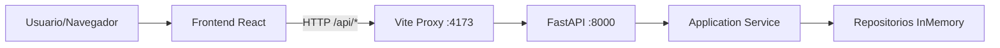
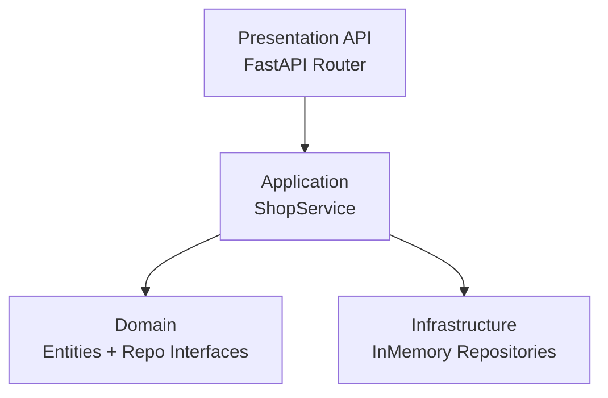
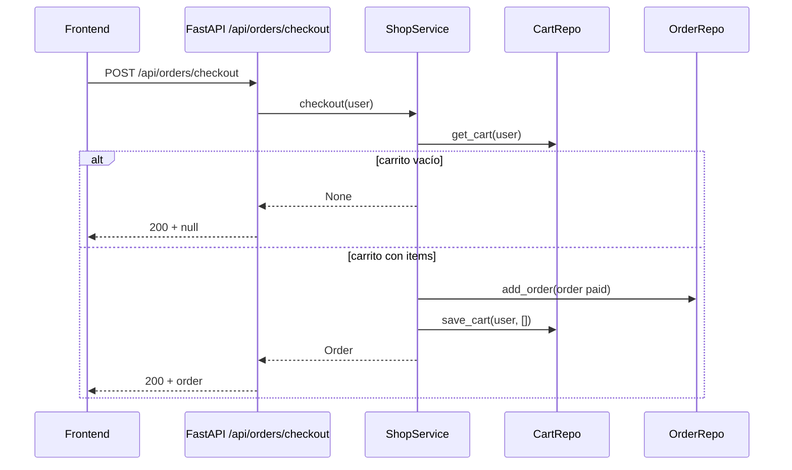
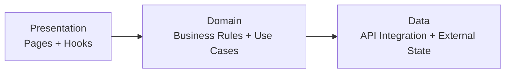
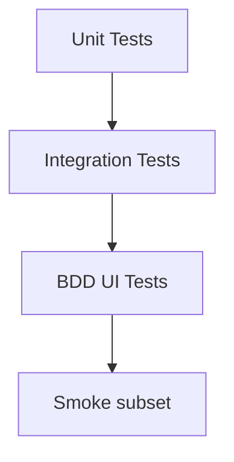

# React + FastAPI BDD Shop

Monorepo de una tienda demo orientada a **BDD (Behavior-Driven Development)**, con frontend en React y backend en FastAPI.

---

## 1) Visión general del proyecto

Este repo está dividido en dos aplicaciones:

- `frontend/`: interfaz web (React + React Router + TanStack Query) con pruebas BDD end-to-end usando Cucumber + Playwright.
- `backend/`: API REST (FastAPI) implementada con capas tipo Clean Architecture y pruebas BDD con `pytest-bdd`.

### Diagrama de alto nivel



---

## 2) Estructura del repositorio

```text
.
├── frontend/
│   ├── src/
│   │   ├── app/                # shell de la app y configuración global
│   │   ├── routes/             # definición de rutas
│   │   ├── features/           # páginas funcionales (cart/checkout/orders)
│   │   ├── presentation/       # composición UI + hooks orientados a vista
│   │   ├── domain/             # entidades, puertos y casos de uso
│   │   ├── data/               # repositorios concretos, mappers, cliente HTTP
│   │   └── api/                # API client del flujo shop
│   ├── features/               # archivos .feature y step definitions de Cucumber
│   └── tests/                  # tests unitarios/integración/e2e técnicos
└── backend/
    ├── app/
    │   ├── domain/             # entidades y contratos de repositorio
    │   ├── application/        # servicios/casos de uso
    │   ├── infrastructure/     # repositorios concretos (in-memory)
    │   └── presentation/       # API REST, esquemas y DI
    └── tests/                  # BDD con pytest-bdd
```

---

## 3) Backend: arquitectura y responsabilidades

El backend sigue una separación en capas:



### Capas

1. **Domain (`backend/app/domain`)**
   - Entidades: `Product`, `CartItem`, `Order`, `OrderStatus`.
   - Contratos de repositorio (interfaces/puertos): productos, carrito y órdenes.

2. **Application (`backend/app/application`)**
   - `ShopService` coordina reglas de negocio:
     - listar productos
     - agregar/quitar del carrito
     - checkout
     - listar órdenes

3. **Infrastructure (`backend/app/infrastructure`)**
   - Repositorios in-memory con datos de prueba:
     - productos (`p1`, `p2`, `p3`)
     - carritos por usuario
     - órdenes por usuario

4. **Presentation (`backend/app/presentation`)**
   - Endpoints REST bajo `/api`.
   - Inyección de dependencias con `get_shop_service()` cacheado con `lru_cache`.

### Flujo de checkout



---

## 4) Endpoints disponibles

Base URL backend: `http://127.0.0.1:8000`

### Salud
- `GET /health`
  - Respuesta: `{ "status": "ok" }`

### Shop (`/api`)
- `GET /api/products`
  - Lista de productos.
- `GET /api/cart`
  - Carrito del usuario fijo `qa-demo-user`.
- `POST /api/cart/items`
  - Body JSON: `{ "product_id": "p1", "quantity": 1 }`
  - Agrega o incrementa ítem en carrito.
- `DELETE /api/cart/items/{product_id}`
  - Decrementa cantidad en 1 o elimina si llega a 0.
- `GET /api/orders`
  - Lista de órdenes del usuario.
- `POST /api/orders/checkout`
  - Crea orden `paid` y vacía carrito.
  - Si carrito está vacío, retorna `null`.

---

## 5) Frontend: separación por capas y arquitectura

El frontend adopta arquitectura en capas explícita:



> Dirección buscada: `presentation -> domain -> data`.

### Capa `presentation`
- Componentes/páginas de UI y manejo de interacción del usuario.
- Solo lógica de visualización y eventos (sin reglas de negocio).
- Ejemplos: `App`, `AppLayout`, `AppRoutes`, páginas de `features/*` y `presentation/pages/*`.

### Capa `domain`
- Reglas de negocio y comportamiento de la aplicación (qué debe pasar, no cómo se pinta).
- Casos de uso y contratos/puertos (`GetProductsUseCase`, `ProductRepository`).
- No depende de React ni de detalles de transporte HTTP.

### Capa `data`
- Integración con fuentes externas y estado remoto.
- Implementa acceso a API (`shopApi`, `httpClient`) y repositorios concretos (`ApiProductRepository`).
- Incluye mapeos DTO -> modelo de dominio cuando aplica.

### Navegación (React Router)
- `/` catálogo
- `/cart` carrito
- `/checkout` checkout
- `/orders` órdenes

### Integración API desde frontend
- `shopApi` centraliza llamadas `fetch` a `/api/*`.
- Vite proxy redirige `/api` a `http://127.0.0.1:8000` en dev.

---

## 6) Estrategia de testing frontend (por etapas)

El proyecto combina distintos niveles:



## Etapa 1: Unit tests (dominio)
- Objetivo: validar reglas puras (ej. invariantes de precios).
- Ejemplo: `GetProductsUseCase.test.ts`.
- No hay red ni navegador.

## Etapa 2: Integration tests (data layer)
- Objetivo: validar integración del repositorio/API client + mapeos.
- Ejemplo: `ApiProductRepository.int.test.ts`.
- **Aquí se usa MSW** para mockear HTTP y controlar respuestas.

## Etapa 3: BDD UI con Cucumber + Playwright
- Objetivo: validar flujos funcionales desde comportamiento de usuario (Given/When/Then).
- Features: catálogo, carrito, checkout, órdenes.
- Steps ejecutan acciones en navegador real (Playwright).

## Etapa 4: Smoke BDD
- Subconjunto rápido con tags `@smoke` para feedback corto.

---

## 7) ¿Cuándo usar Playwright mocking y cuándo MSW?

### Usar **MSW** cuando…
- Querés probar capa `data` o lógica cliente HTTP en entorno de test de Node/Vitest.
- Necesitás mocks declarativos de endpoints con alta velocidad y aislamiento.
- No necesitás render real de navegador.

En este repo: integración de `ApiProductRepository` usa `setupServer` de `msw/node`.

### Usar **Playwright (sin mocking o con mocking de red)** cuando…
- Querés validar experiencia real del usuario en navegador.
- Importa el rendering, navegación, selectores, tiempos de UI y side-effects visibles.
- En caso de inestabilidad de backend externo, podés mockear red con Playwright route/intercept.

En este repo: los escenarios BDD y e2e corren contra la app real (frontend + backend), no contra mocks de Playwright.

---

## 8) Qué está configurado hoy

### Backend
- FastAPI app con CORS habilitado para `http://localhost:4173` y `http://127.0.0.1:4173`.
- Router montado con prefijo `/api`.
- DI cacheada del `ShopService` con repositorios in-memory.
- Test BDD en `pytest-bdd` para checkout.

### Frontend
- Vite en puerto `4173` (`strictPort: true`).
- Proxy `/api` -> backend `8000`.
- React Router para páginas de shop.
- TanStack Query para cache/invalidaciones:
  - invalidación de carrito al agregar/quitar
  - invalidación de carrito + órdenes en checkout
- Cucumber configurado para steps compilados en `generated/node`.
- Playwright configurado con `baseURL` `http://127.0.0.1:4173` (override por `BASE_URL`).

---

## 9) Cómo correr el proyecto

## Backend

```bash
cd backend
python -m venv .venv
source .venv/bin/activate
pip install -e .[test]
uvicorn app.main:app --reload --port 8000
```

## Frontend

```bash
cd frontend
pnpm install
pnpm dev
```

Con ambos levantados:
- Frontend: `http://127.0.0.1:4173`
- Backend: `http://127.0.0.1:8000`

---

## 10) Comandos de testing

## Backend

```bash
cd backend
pytest
```

## Frontend

```bash
cd frontend
pnpm run test:bdd
pnpm run test:smoke
```

---

## 11) Resumen de diseño

- Arquitectura separada por capas en ambos lados para facilitar mantenibilidad y testabilidad.
- BDD end-to-end para validar comportamiento de negocio observable.
- MSW en integración de capa de datos para aislar HTTP.
- Playwright + Cucumber para flujos reales de usuario y contrato funcional entre UI y API.
