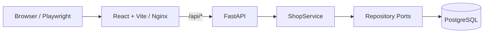
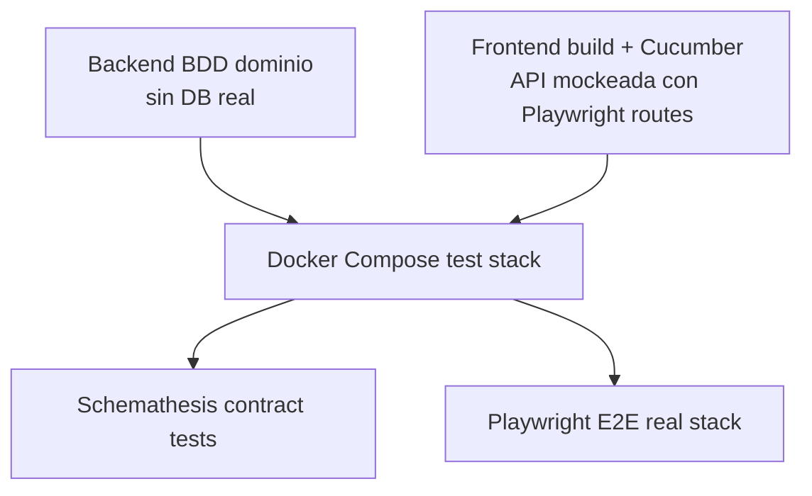

# React + FastAPI BDD Shop

Monorepo de ejemplo para una tienda online construido con **React + Vite** en el frontend y **FastAPI + PostgreSQL** en el backend. El foco del proyecto es practicar una estrategia de testing progresiva: primero pruebas rápidas sin servicios reales, luego pruebas de contrato y E2E contra un stack completo levantado con Docker Compose.

---

## Índice

1. [Estado actual del proyecto](#estado-actual-del-proyecto)
2. [Arquitectura general](#arquitectura-general)
3. [Backend](#backend)
4. [Frontend](#frontend)
5. [Contrato OpenAPI y SDK TypeScript](#contrato-openapi-y-sdk-typescript)
6. [Estrategia actual de testing](#estrategia-actual-de-testing)
7. [GitHub Actions](#github-actions)
8. [Cómo ejecutar el proyecto](#cómo-ejecutar-el-proyecto)
9. [Comandos útiles](#comandos-útiles)
10. [Limitaciones actuales](#limitaciones-actuales)
11. [Mejoras pendientes recomendadas](#mejoras-pendientes-recomendadas)

---

## Estado actual del proyecto

Actualmente el repositorio contiene:

- Un **backend FastAPI** con endpoints REST para catálogo, carrito y órdenes.
- Persistencia real en **PostgreSQL** mediante repositorios concretos.
- Repositorios **in-memory** para pruebas aisladas de dominio/BDD sin depender de base de datos.
- Un **frontend React** con React Router, TanStack Query y Vite.
- Features BDD en frontend ejecutadas con **Cucumber + Playwright**.
- Un test E2E técnico con **Playwright Test**.
- Un contrato OpenAPI en `frontend/openapi/shop.openapi.yaml`.
- Una SDK TypeScript generada y versionada en `frontend/src/generated/shop-sdk`.
- Un workflow de CI en GitHub Actions dividido en fases rápidas y fase de integración.
- Un `docker-compose.test.yml` específico para tests de integración con datos determinísticos.

El proyecto todavía es una demo funcional, no una aplicación productiva completa. La autenticación, usuarios reales, autorizaciones, migraciones formales y cobertura extensa de tests quedan como mejoras pendientes.

---

## Arquitectura general



### Estructura principal

```text
.
├── .github/workflows/ci.yml          # Pipeline de CI por fases
├── docker-compose.yml                # Stack local principal
├── docker-compose.test.yml           # Stack de integración para CI/tests
├── tests/fixtures/sql/               # Fixtures SQL determinísticos para integración
├── backend/
│   ├── app/
│   │   ├── domain/                   # Entidades y contratos de repositorio
│   │   ├── application/              # Casos de uso / servicios
│   │   ├── infrastructure/           # Repositorios PostgreSQL e in-memory
│   │   └── presentation/             # FastAPI router, schemas y DI
│   ├── tests/features/               # Features BDD backend
│   └── tests/steps/                  # Step definitions pytest-bdd
└── frontend/
    ├── openapi/                      # Contrato OpenAPI fuente del SDK
    ├── scripts/generate-sdk.mjs      # Generador local determinístico del SDK
    ├── src/
    │   ├── generated/shop-sdk/        # SDK TypeScript versionada
    │   ├── app/                      # App shell y QueryClient
    │   ├── routes/                   # Rutas React Router
    │   ├── features/                 # Páginas funcionales principales
    │   ├── presentation/             # Capa de presentación alternativa/en evolución
    │   ├── domain/                   # Entidades, puertos y casos de uso
    │   └── data/                     # Repositorios y mappers hacia API
    ├── features/                     # BDD frontend con Cucumber
    └── tests/                        # Tests técnicos domain/integration/e2e
```

---

## Backend

### Stack

- Python 3.11+ / CI con Python 3.12.
- FastAPI.
- Uvicorn.
- Pydantic.
- Psycopg 3.
- PostgreSQL 16 Alpine en Docker Compose.
- pytest + pytest-bdd para tests BDD backend.
- Schemathesis para contract testing contra OpenAPI generado por FastAPI.

### Endpoints disponibles

Base backend local: `http://127.0.0.1:8000`.

| Método | Ruta | Descripción |
| --- | --- | --- |
| `GET` | `/health` | Healthcheck de la API. |
| `GET` | `/api/products` | Lista productos disponibles. |
| `GET` | `/api/cart` | Lista el carrito del usuario demo fijo. |
| `POST` | `/api/cart/items` | Agrega o incrementa un producto del carrito. |
| `DELETE` | `/api/cart/items/{product_id}` | Quita un producto del carrito. |
| `GET` | `/api/orders` | Lista órdenes del usuario demo fijo. |
| `POST` | `/api/orders/checkout` | Crea una orden `paid` y vacía el carrito; si no hay items, retorna `null`. |

### Persistencia

El backend usa PostgreSQL para ejecución real. La URL de conexión se resuelve así:

1. Si existe `DATABASE_URL`, usa ese valor.
2. Si no existe, usa el default interno apuntando al servicio Docker `postgres` con base `shopdb`, usuario `shop_user` y contraseña `shop_password`.

Esto permite ejecutar el mismo backend tanto en el `docker-compose.yml` principal como en el `docker-compose.test.yml` de integración.

### Datos iniciales

- `backend/init.sql` crea las tablas base (`products`, `cart_items`, `orders`, `order_items`) y carga productos demo.
- `tests/fixtures/sql/02_bdd_scenarios.sql` resetea datos mutables y asegura productos determinísticos para integración/BDD.

---

## Frontend

### Stack

- React 18.
- Vite.
- React Router.
- TanStack Query.
- TypeScript.
- Cucumber.js.
- Playwright.
- Chai para assertions en steps BDD.

### Rutas de UI

| Ruta | Pantalla |
| --- | --- |
| `/` | Catálogo de productos. |
| `/cart` | Carrito. |
| `/checkout` | Confirmación de compra. |
| `/orders` | Órdenes creadas. |

### Comunicación con API

El frontend consume rutas relativas `/api/*`. En desarrollo, Vite proxya `/api` hacia `http://127.0.0.1:8000`. En Docker/Nginx, `frontend/nginx.conf` proxya `/api/` hacia el servicio `backend:8000`.

### Estado remoto

TanStack Query se usa para consultar e invalidar datos de:

- productos,
- carrito,
- órdenes.

Las mutaciones de carrito invalidan el carrito; el checkout invalida carrito y órdenes.

---

## Contrato OpenAPI y SDK TypeScript

El contrato HTTP mantenido manualmente para el frontend vive en:

```text
frontend/openapi/shop.openapi.yaml
```

La SDK consumida por el frontend vive en:

```text
frontend/src/generated/shop-sdk
```

El script actual de generación es local y determinístico:

```bash
cd frontend
pnpm run generate:sdk
```

El CI ejecuta:

```bash
pnpm run generate:sdk
git diff --exit-code src/generated/shop-sdk
```

Esto detecta **drift del SDK**: si alguien cambia el contrato/generador y no deja la SDK versionada actualizada, el job falla.

> Nota importante: el generador actual (`frontend/scripts/generate-sdk.mjs`) es intencionalmente simple y está adaptado al contrato actual del proyecto. No reemplaza completamente a un generador OpenAPI general-purpose. Una mejora pendiente es volver a integrar un generador estándar como `@hey-api/openapi-ts` o `openapi-typescript` con dependencias fijadas en lockfile para evitar `pnpm dlx` en CI.

---

## Estrategia actual de testing

La estrategia actual separa tests por costo y dependencia de infraestructura.



### 1. Backend BDD de dominio / aplicación

**Objetivo:** validar comportamiento de checkout sin levantar backend HTTP real ni PostgreSQL.

- Herramientas: `pytest`, `pytest-bdd`, `TestClient`.
- Ubicación:
  - `backend/tests/features/checkout.feature`
  - `backend/tests/steps/test_checkout_steps.py`
- Aislamiento:
  - Se usa `app.dependency_overrides` para reemplazar `get_shop_service`.
  - El `ShopService` se construye con repositorios in-memory.
- Qué valida hoy:
  - Dado un carrito con producto,
  - cuando se solicita checkout,
  - se crea una orden con estado `paid`,
  - y el carrito queda vacío.

Comando esperado:

```bash
cd backend
pytest tests/features tests/steps -v
```

### 2. Frontend BDD con Cucumber + Playwright y API mockeada

**Objetivo:** validar flujos de usuario de forma rápida sin backend real.

- Herramientas: `@cucumber/cucumber`, `playwright`, `chai`.
- Features:
  - `frontend/features/product-list.feature`
  - `frontend/features/cart.feature`
  - `frontend/features/checkout.feature`
- Steps:
  - `frontend/features/step-definitions/shop.steps.ts`
- World/hooks:
  - `frontend/features/support/world.ts`
  - `frontend/features/support/hooks.ts`
- Mocking actual:
  - Se interceptan requests con `page.route(...)` de Playwright.
  - Se simulan endpoints `/api/products`, `/api/cart`, `/api/cart/items`, `/api/orders` y `/api/orders/checkout`.

Comando esperado:

```bash
cd frontend
pnpm run build
pnpm exec vite preview --host 127.0.0.1 --port 4173
BASE_URL=http://127.0.0.1:4173 pnpm run test:bdd
```

En CI, el workflow levanta `vite preview`, espera `http://127.0.0.1:4173` con `wait-on` y ejecuta `pnpm run test:bdd`.

### 3. Smoke BDD frontend

**Objetivo:** tener un subconjunto rápido de escenarios críticos.

- Script: `pnpm run test:smoke`.
- Implementación: Cucumber con tag `@smoke`.
- Scenarios actuales marcados como smoke:
  - listado/agregado de producto,
  - checkout exitoso.

Comando:

```bash
cd frontend
pnpm run test:smoke
```

### 4. Playwright E2E técnico contra stack real

**Objetivo:** validar que la aplicación servida realmente puede comunicarse con backend y mostrar datos reales del stack Docker.

- Herramienta: `@playwright/test`.
- Test actual: `frontend/tests/e2e/products.spec.ts`.
- Qué valida hoy:
  - navega al catálogo,
  - ve el heading `Product Catalog`,
  - ve el botón `add-Product A`, que depende de datos reales del backend/DB.

Comando esperado con stack real levantado:

```bash
cd frontend
BASE_URL=http://127.0.0.1:4173 pnpm exec playwright test
```

### 5. Schemathesis contract testing

**Objetivo:** probar la API real a partir del OpenAPI expuesto por FastAPI.

- Herramienta: Schemathesis.
- Fuente: `http://127.0.0.1:8000/openapi.json`.
- Se ejecuta en el job de integración después de levantar `docker-compose.test.yml`.

Comando esperado con backend real levantado:

```bash
schemathesis run http://127.0.0.1:8000/openapi.json --checks all --max-examples 50
```

### 6. Tests técnicos frontend existentes pero no integrados al CI actual

Existen archivos de tests técnicos en:

- `frontend/tests/domain/GetProductsUseCase.test.ts`
- `frontend/tests/integration/ApiProductRepository.int.test.ts`

Estos tests usan `vitest` y `msw`, pero el `package.json` actual no tiene script `test`, ni incluye explícitamente `vitest`/`msw` como dependencias de desarrollo. Por eso se consideran **diseño/estructura existente pendiente de cablear** y no parte confiable del pipeline actual hasta agregar dependencias, script y ejecución en CI.

---

## GitHub Actions

Workflow principal:

```text
.github/workflows/ci.yml
```

### Fase rápida 1: `backend-unit`

Corre primero y no necesita backend real ni PostgreSQL.

Pasos principales:

1. Checkout.
2. Setup Python 3.12.
3. Instalación backend con extras de test.
4. Ejecución de `pytest tests/features tests/steps -v`.

### Fase rápida 2: `frontend-unit`

Corre en paralelo con `backend-unit` y no necesita backend real.

Pasos principales:

1. Checkout.
2. Setup pnpm y Node 20.
3. `pnpm install --frozen-lockfile`.
4. Drift check del SDK:
   - `pnpm run generate:sdk`
   - `git diff --exit-code src/generated/shop-sdk`
5. Instalación de Chromium para Playwright.
6. Build frontend.
7. `vite preview`.
8. Cucumber BDD con mocks por Playwright routes.
9. Upload del reporte Cucumber como artifact.

### Fase lenta: `integration`

Solo corre si pasan `backend-unit` y `frontend-unit`.

Pasos principales:

1. Instala Schemathesis.
2. Instala dependencias frontend y navegadores Playwright.
3. Levanta `docker-compose.test.yml` con `up -d --wait`.
4. Verifica fixtures en PostgreSQL.
5. Ejecuta Schemathesis contra `http://127.0.0.1:8000/openapi.json`.
6. Ejecuta Playwright E2E contra `http://127.0.0.1:4173`.
7. Si falla, imprime logs de backend, seed y frontend.
8. Siempre baja el stack con `docker compose -f docker-compose.test.yml down -v` para limpiar volúmenes.

---

## Cómo ejecutar el proyecto

### Opción A: stack completo con Docker Compose

```bash
docker compose up --build
```

Servicios expuestos:

| Servicio | URL / puerto |
| --- | --- |
| Frontend | `http://127.0.0.1:4173` |
| Backend | `http://127.0.0.1:8000` |
| PostgreSQL | `127.0.0.1:5432` |

Credenciales de PostgreSQL local:

```text
DB: shopdb
User: shop_user
Password: shop_password
```

### Opción B: stack de test/integración

```bash
docker compose -f docker-compose.test.yml up --build --wait
```

Al finalizar:

```bash
docker compose -f docker-compose.test.yml down -v
```

El `-v` elimina volúmenes y evita datos residuales entre corridas.

### Opción C: desarrollo backend local

Requiere tener PostgreSQL accesible o exportar un `DATABASE_URL` válido.

```bash
cd backend
python -m venv .venv
source .venv/bin/activate
pip install -e ".[test]"
uvicorn app.main:app --reload --port 8000
```

### Opción D: desarrollo frontend local

```bash
cd frontend
pnpm install
pnpm dev
```

Frontend dev server: `http://127.0.0.1:4173`.

---

## Comandos útiles

### Backend

```bash
cd backend
pytest tests/features tests/steps -v
```

```bash
cd backend
uvicorn app.main:app --reload --port 8000
```

### Frontend

```bash
cd frontend
pnpm install --frozen-lockfile
```

```bash
cd frontend
pnpm run generate:sdk
```

```bash
cd frontend
pnpm run build
```

```bash
cd frontend
pnpm run test:bdd
```

```bash
cd frontend
pnpm run test:smoke
```

```bash
cd frontend
pnpm exec playwright test
```

### Integración

```bash
docker compose -f docker-compose.test.yml up --build --wait
```

```bash
schemathesis run http://127.0.0.1:8000/openapi.json --checks all --max-examples 50
```

```bash
docker compose -f docker-compose.test.yml down -v
```

---

## Limitaciones actuales

1. **Usuario fijo**: el backend usa `qa-demo-user`; no existe autenticación real.
2. **Contrato duplicado**: FastAPI expone `/openapi.json`, pero el frontend mantiene su propio `frontend/openapi/shop.openapi.yaml`. Hay riesgo de divergencia si no se automatiza la sincronización.
3. **SDK generator simplificado**: el generador actual funciona para el contrato presente, pero no es un parser OpenAPI completo.
4. **Tests Vitest/MSW no cableados**: existen archivos de test, pero faltan script y dependencias explícitas para ejecutarlos en CI.
5. **Cobertura de backend limitada**: hoy el BDD backend cubre checkout; faltan pruebas para errores, carrito, productos y órdenes.
6. **Schemathesis puede modificar estado**: algunos endpoints son mutantes (`POST /cart/items`, `POST /orders/checkout`, `DELETE /cart/items/{product_id}`), por lo que conviene aislar/resetear estado con más granularidad si crece la suite.
7. **Fixtures simples**: el seed actual es SQL directo; todavía no hay factories ni fixtures por escenario.
8. **Sin migraciones formales**: `backend/init.sql` inicializa schema, pero no hay Alembic u otra herramienta de migración.
9. **Sin coverage gates**: el CI no exige cobertura mínima.
10. **Sin lint/format/typecheck globales**: el build TypeScript valida parte del frontend, pero no hay linting ni formatting enforced en todo el monorepo.

---

## Mejoras pendientes recomendadas

### Alta prioridad

1. **Unificar fuente OpenAPI**
   - Generar el contrato frontend desde `http://backend/openapi.json` o exportarlo desde FastAPI en CI.
   - Evitar mantener dos contratos manualmente.

2. **Reemplazar el generador local por uno estándar**
   - Agregar `@hey-api/openapi-ts` u otra herramienta al `devDependencies`.
   - Evitar `pnpm dlx` en CI.
   - Mantener `pnpm run generate:sdk && git diff --exit-code` como drift check.

3. **Cablear tests Vitest/MSW**
   - Agregar `vitest` y `msw` a `devDependencies`.
   - Agregar script `test:unit` o `test:frontend`.
   - Integrarlo en `frontend-unit` antes de los BDD.

4. **Agregar lint y format checks**
   - Frontend: ESLint + Prettier.
   - Backend: Ruff + formatter.
   - CI debería fallar ante errores de estilo/lint.

5. **Ampliar BDD backend**
   - Agregar escenarios para:
     - carrito vacío en checkout,
     - producto inexistente,
     - acumulación de cantidades,
     - remover productos,
     - listado de órdenes.

### Media prioridad

6. **Fixtures por escenario**
   - Separar base data de datos por escenario.
   - Agregar reset transaccional o seed por test para evitar interferencias entre escenarios mutantes.

7. **Test helpers para estado real**
   - Agregar endpoints internos solo para test o scripts de reset controlados por `ENVIRONMENT=test`.
   - Útil para E2E real sin depender únicamente de SQL inicial.

8. **Coverage gates**
   - Backend: `pytest --cov`.
   - Frontend: coverage con Vitest.
   - Publicar reportes como artifacts.

9. **Mejor reporting BDD/E2E**
   - Subir screenshots/videos/traces de Playwright ante fallos.
   - Publicar reporte HTML de Cucumber y Playwright.

10. **Paralelización segura**
    - Asegurar que tests mutantes puedan correr en paralelo usando usuarios/IDs por worker o DB por job.

### Baja prioridad / evolución funcional

11. **Autenticación y usuarios reales**
    - Reemplazar `qa-demo-user` por login/session/token.
    - Agregar roles y permisos si el dominio crece.

12. **Migraciones reales**
    - Introducir Alembic para schema versionado.
    - Ejecutar migraciones en `docker-compose.test.yml` antes del seed.

13. **Mejor arquitectura frontend**
    - Eliminar duplicaciones entre `src/features/*` y `src/presentation/*` si ya no se necesitan.
    - Definir una única convención de capas para nuevas pantallas.

14. **Pruebas de accesibilidad**
    - Integrar axe/playwright para checks básicos de accesibilidad.

15. **Matrix CI**
    - Ejecutar versiones adicionales de Node/Python si el proyecto lo requiere.

---

## Resumen

El proyecto ya tiene una base sólida para BDD full-stack:

- pruebas rápidas backend sin infraestructura real,
- pruebas BDD frontend con navegador y API mockeada,
- drift check de SDK,
- contract testing con Schemathesis,
- E2E contra stack real con Docker Compose,
- fixtures determinísticos para integración.

El siguiente paso más importante es fortalecer la confiabilidad del pipeline: unificar OpenAPI, usar un generador SDK estándar versionado, cablear Vitest/MSW, agregar lint/format y ampliar cobertura BDD del backend y E2E real.
