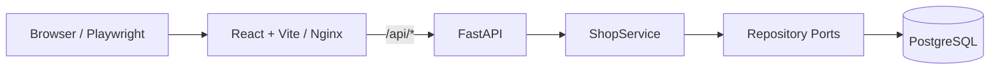
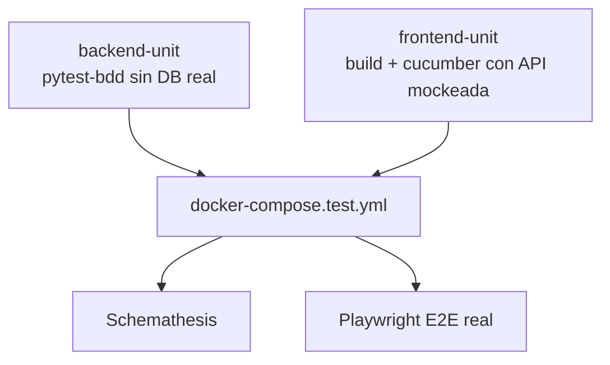

# React + FastAPI BDD Shop

Monorepo de una tienda demo con **React + Vite** en el frontend y **FastAPI + PostgreSQL** en el backend. El objetivo principal del proyecto es demostrar una estrategia de testing full-stack progresiva: pruebas rápidas sin infraestructura real, checks de contrato, y E2E contra un stack real determinístico.

El pipeline actual ya quedó validado con:

- `backend-unit`: BDD backend/domain sin DB real.
- `frontend-unit`: build + Cucumber/Playwright con API mockeada + drift check de SDK.
- `integration`: Docker Compose test stack + Schemathesis + Playwright E2E real.

---

## Índice

1. [Estado actual](#estado-actual)
2. [Arquitectura del proyecto](#arquitectura-del-proyecto)
3. [Backend](#backend)
4. [Frontend](#frontend)
5. [SDK y contrato OpenAPI](#sdk-y-contrato-openapi)
6. [Testing actual](#testing-actual)
7. [GitHub Actions](#github-actions)
8. [Aprendizajes importantes](#aprendizajes-importantes)
9. [Cómo ejecutar localmente](#cómo-ejecutar-localmente)
10. [Comandos útiles](#comandos-útiles)
11. [Limitaciones actuales](#limitaciones-actuales)
12. [Mejoras pendientes](#mejoras-pendientes)

---

## Estado actual

El repo contiene:

- **Backend FastAPI** para catálogo, carrito y órdenes.
- **PostgreSQL real** para ejecución local/integración.
- **Repositorios in-memory** para tests rápidos aislados.
- **Frontend React** con React Router y TanStack Query.
- **BDD frontend** con Cucumber.js + Playwright.
- **BDD backend** con pytest-bdd.
- **Schemathesis** para fuzzing/coverage/contract testing de la API real.
- **Playwright Test** para E2E técnico contra el stack real.
- **SDK TypeScript generada** y versionada en `frontend/src/generated/shop-sdk`.
- **Docker Compose de test** con fixtures determinísticos.
- **README orientado a operación y aprendizaje**: documenta no solo cómo correr tests, sino también por qué se tomaron ciertas decisiones.

---

## Arquitectura del proyecto



### Estructura principal

```text
.
├── .github/workflows/ci.yml
├── docker-compose.yml
├── docker-compose.test.yml
├── tests/fixtures/sql/02_bdd_scenarios.sql
├── backend/
│   ├── app/
│   │   ├── domain/
│   │   ├── application/
│   │   ├── infrastructure/
│   │   └── presentation/
│   └── tests/
└── frontend/
    ├── openapi/shop.openapi.yaml
    ├── scripts/generate-sdk.mjs
    ├── src/generated/shop-sdk/
    ├── features/
    └── tests/
```

---

## Backend

### Stack

- Python 3.12 en CI.
- FastAPI.
- Pydantic v2.
- Psycopg 3.
- PostgreSQL 16 Alpine.
- pytest + pytest-bdd.
- Schemathesis.

### Endpoints

Base backend local: `http://127.0.0.1:8000`.

| Método | Ruta | Descripción |
| --- | --- | --- |
| `GET` | `/health` | Healthcheck de la API. |
| `GET` | `/api/products` | Lista productos disponibles. |
| `GET` | `/api/cart` | Lista carrito del usuario demo fijo. |
| `POST` | `/api/cart/items` | Agrega o incrementa un producto. `quantity` acepta enteros de `1` a `100` **por request**. |
| `DELETE` | `/api/cart/items/{product_id}` | Quita una unidad de un producto del carrito. |
| `GET` | `/api/orders` | Lista órdenes del usuario demo fijo. |
| `POST` | `/api/orders/checkout` | Crea orden `paid` y vacía carrito; si no hay items retorna `null`. |

### Validación actual

`backend/app/presentation/schemas.py` define tipos explícitos:

- `ProductId`: string no vacío, máximo 64 caracteres, patrón `^[A-Za-z0-9_-]+$`.
- `RequestQuantity`: entero JSON para requests, mínimo `1`, máximo `100`, rechazando booleanos y strings.
- `ResponseQuantity`: entero positivo para respuestas, sin máximo bajo, porque el carrito puede acumular muchas unidades a partir de varios requests válidos.

La separación `RequestQuantity` vs `ResponseQuantity` fue clave: Schemathesis encontró que limitar también las respuestas a `100` producía `500` cuando varios requests válidos acumulaban más de 100 unidades en el carrito.

### Persistencia

El backend toma la conexión desde:

1. `DATABASE_URL`, si existe.
2. `DEFAULT_DATABASE_URL`, si no existe.

Los inserts batch con Psycopg se hacen con cursor explícito:

```python
with connection.cursor() as cursor:
    cursor.executemany(...)
```

Esto evita errores como `AttributeError: 'Connection' object has no attribute 'executemany'` y deja los cursores cerrados correctamente tras cada operación.

---

## Frontend

### Stack

- React 18.
- Vite.
- React Router.
- TanStack Query.
- TypeScript.
- Cucumber.js.
- Playwright.

### Rutas UI

| Ruta | Pantalla |
| --- | --- |
| `/` | Catálogo de productos. |
| `/cart` | Carrito. |
| `/checkout` | Checkout. |
| `/orders` | Órdenes. |

### API desde frontend

El frontend consume rutas relativas `/api/*`.

- En desarrollo, Vite proxya `/api` a `http://127.0.0.1:8000`.
- En Docker, Nginx proxya `/api/` al servicio `backend:8000`.

---

## SDK y contrato OpenAPI

El frontend mantiene un contrato OpenAPI en:

```text
frontend/openapi/shop.openapi.yaml
```

La SDK generada vive en:

```text
frontend/src/generated/shop-sdk
```

La generación actual se hace con un script local determinístico:

```bash
cd frontend
pnpm run generate:sdk
```

El CI verifica drift con:

```bash
pnpm run generate:sdk
git diff --exit-code src/generated/shop-sdk
```

### Aprendizaje sobre SDK drift

El drift check es útil incluso con un generador simple, porque fuerza una regla clara: si cambia el contrato o el generador, el SDK versionado también debe cambiar. A futuro conviene reemplazar el generador local por una herramienta estándar (`@hey-api/openapi-ts`, `openapi-typescript`, etc.) instalada como dependencia fija en el lockfile, no ejecutada con `pnpm dlx`.

---

## Testing actual

La estrategia actual divide los tests por dependencia de infraestructura.



### 1. Backend BDD rápido

Objetivo: validar comportamiento de dominio/aplicación sin PostgreSQL real.

- Feature: `backend/tests/features/checkout.feature`.
- Steps: `backend/tests/steps/test_checkout_steps.py`.
- Usa `app.dependency_overrides` para inyectar `ShopService` con repositorios in-memory.

Comando:

```bash
cd backend
pytest tests/features tests/steps -v
```

### 2. Frontend BDD rápido

Objetivo: validar flujos de usuario sin backend real.

- Features: `frontend/features/*.feature`.
- Steps: `frontend/features/step-definitions/shop.steps.ts`.
- World/hooks: `frontend/features/support/*`.
- Mocking: `page.route(...)` de Playwright intercepta `/api/*`.

Comando típico:

```bash
cd frontend
pnpm run build
pnpm exec vite preview --host 127.0.0.1 --port 4173
BASE_URL=http://127.0.0.1:4173 pnpm run test:bdd
```

### 3. Smoke BDD frontend

Subconjunto con tags `@smoke`:

```bash
cd frontend
pnpm run test:smoke
```

### 4. Schemathesis

Objetivo: validar la API real contra `openapi.json`, generando casos de coverage y fuzzing.

Comando actual:

```bash
schemathesis run http://127.0.0.1:8000/openapi.json \
  --checks all \
  --phases=examples,coverage,fuzzing \
  --max-examples 50
```

La fase `stateful` queda desactivada por ahora porque la API actual usa recursos agregados por usuario fijo (`/api/cart`) y no links REST canónicos. Sin links OpenAPI explícitos, Schemathesis puede inferir relaciones incorrectas y reportar falsos positivos.

### 5. Playwright E2E real

Objetivo: validar frontend y backend reales levantados con Docker Compose.

Playwright está limitado a:

```text
frontend/tests/e2e/**/*.spec.ts
```

Esto evita que el runner de Playwright intente importar tests Vitest/MSW ubicados en `frontend/tests/domain` o `frontend/tests/integration`.

Comando:

```bash
cd frontend
BASE_URL=http://127.0.0.1:4173 pnpm exec playwright test
```

---

## GitHub Actions

Workflow: `.github/workflows/ci.yml`.

### `backend-unit`

- Setup Python 3.12.
- Instala backend con extras de test.
- Corre `pytest tests/features tests/steps -v`.

### `frontend-unit`

- Setup pnpm + Node 20.
- `pnpm install --frozen-lockfile`.
- `pnpm run generate:sdk`.
- `git diff --exit-code src/generated/shop-sdk`.
- Instala Chromium Playwright.
- Build frontend.
- Levanta Vite preview.
- Corre Cucumber BDD con API mockeada.
- Sube reporte Cucumber.

### `integration`

Corre solo si pasan `backend-unit` y `frontend-unit`.

1. Instala Schemathesis.
2. Instala dependencias frontend y navegadores.
3. Levanta `docker-compose.test.yml`.
4. Espera `http://127.0.0.1:4173/health` desde el runner.
5. Verifica fixtures en PostgreSQL.
6. Corre Schemathesis.
7. Corre Playwright E2E real.
8. Si falla, imprime logs de backend, seed y frontend.
9. Siempre ejecuta `docker compose -f docker-compose.test.yml down -v`.

---

## Aprendizajes importantes

Esta sección resume lo aprendido durante la estabilización del pipeline.

### 1. Separar tests rápidos de integración no es opcional

Intentar levantar backend, frontend y DB para todo vuelve el feedback lento y hace más difícil diagnosticar fallos. La separación final quedó así:

| Capa | Backend real | DB real | Objetivo |
| --- | --- | --- | --- |
| Backend BDD | No | No | Dominio/aplicación aislados. |
| Frontend BDD | No | No | UX y navegación con API mockeada. |
| Schemathesis | Sí | Sí | Contrato/fuzzing contra API real. |
| Playwright E2E | Sí | Sí | Flujo real frontend + backend. |

### 2. Schemathesis encuentra bugs reales y también obliga a mejorar el contrato

Schemathesis encontró varios problemas reales:

- `404` no documentado cuando un producto no existía.
- `500` por usar `connection.executemany` en lugar de `cursor.executemany` con Psycopg 3.
- `500` por enteros enormes que pasaban validación y llegaban a columnas `INTEGER` de PostgreSQL.
- `500` por response validation cuando el schema de respuesta era más estricto que el estado acumulado real.
- Diferencias entre lo que JSON Schema considera `integer` (`100.0` sin fracción) y validaciones demasiado estrictas en Pydantic.

La lección principal: el contrato no debe describir lo que “esperamos que mande el frontend”, sino todo lo que la API acepta/rechaza de forma estable y documentada.

### 3. Validar requests y responses requiere modelos distintos

`quantity` de entrada y `quantity` de salida no tienen la misma semántica:

- Request: cada add-to-cart debe estar acotado (`1..100`).
- Response: el carrito puede acumular más de 100 si se hacen muchos requests válidos.

Por eso existen `RequestQuantity` y `ResponseQuantity`. Reutilizar el mismo tipo para ambos lados generó falsos `500` por validación de respuesta.

### 4. Los fixtures para contract testing no deben inventar datos para tapar fallos

Agregar un producto artificial con ID `0` hizo que Schemathesis entrara por caminos mutantes inesperados. La solución correcta fue:

- documentar `404` para productos válidos pero inexistentes,
- agregar ejemplos reales con `p1`,
- mantener fixtures de negocio determinísticos sin datos “para complacer al fuzzer”.

### 5. Psycopg 3 no es psycopg2

En Psycopg 3, `executemany` debe ejecutarse en cursor. Además, conviene usar context managers para cerrar cursores:

```python
with connection.cursor() as cursor:
    cursor.executemany(...)
```

Esto corrigió los `500` que aparecían al persistir carrito y órdenes.

### 6. Playwright Test debe descubrir solo specs Playwright

`pnpm exec playwright test` intentaba importar tests `vitest` porque estaban bajo `frontend/tests`. La solución fue acotar discovery:

```ts
testDir: './tests/e2e',
testMatch: '**/*.spec.ts'
```

Cada runner debe tener su propio patrón de archivos.

### 7. Healthchecks de contenedor vs readiness desde runner

El healthcheck del frontend falló cuando dependía de herramientas dentro de la imagen Nginx. Se reemplazó por una espera desde GitHub Actions usando `wait-on` contra `http://127.0.0.1:4173/health`. Es más explícito y no depende de binarios disponibles dentro del contenedor.

### 8. La fase stateful de Schemathesis requiere diseño explícito

No basta con activarla. Para que sea útil hay que modelar links OpenAPI o tener endpoints REST canónicos que permitan razonar sobre crear/usar/borrar recursos. En esta app, el carrito es un agregado mutable por usuario fijo, así que `stateful` queda pendiente.

---

## Cómo ejecutar localmente

### Stack principal

```bash
docker compose up --build
```

Servicios:

| Servicio | URL |
| --- | --- |
| Frontend | `http://127.0.0.1:4173` |
| Backend | `http://127.0.0.1:8000` |
| PostgreSQL | `127.0.0.1:5432` |

Credenciales DB:

```text
DB: shopdb
User: shop_user
Password: shop_password
```

### Stack de integración

```bash
docker compose -f docker-compose.test.yml up --build --wait
```

Luego:

```bash
docker compose -f docker-compose.test.yml down -v
```

El `-v` elimina volúmenes para evitar datos residuales.

### Backend local

```bash
cd backend
python -m venv .venv
source .venv/bin/activate
pip install -e ".[test]"
uvicorn app.main:app --reload --port 8000
```

### Frontend local

```bash
cd frontend
pnpm install
pnpm dev
```

---

## Comandos útiles

### Backend

```bash
cd backend
pytest tests/features tests/steps -v
```

```bash
cd backend
uvicorn app.main:app --reload --port 8000
```

### Frontend

```bash
cd frontend
pnpm install --frozen-lockfile
```

```bash
cd frontend
pnpm run generate:sdk
```

```bash
cd frontend
pnpm run build
```

```bash
cd frontend
pnpm run test:bdd
```

```bash
cd frontend
pnpm run test:smoke
```

```bash
cd frontend
pnpm exec playwright test
```

### Integración

```bash
docker compose -f docker-compose.test.yml up --build --wait
```

```bash
schemathesis run http://127.0.0.1:8000/openapi.json \
  --checks all \
  --phases=examples,coverage,fuzzing \
  --max-examples 50
```

```bash
docker compose -f docker-compose.test.yml down -v
```

---

## Limitaciones actuales

1. **Usuario fijo**: la app usa `qa-demo-user`; no hay autenticación.
2. **Contrato duplicado**: FastAPI expone `/openapi.json`, pero el frontend mantiene `frontend/openapi/shop.openapi.yaml`.
3. **Generador SDK simple**: funciona para el contrato actual, pero no reemplaza a un generador OpenAPI completo.
4. **Vitest/MSW no cableados**: existen tests en `frontend/tests/domain` e `integration`, pero falta agregar dependencias/scripts CI.
5. **BDD backend limitado**: hoy cubre principalmente checkout.
6. **Schemathesis stateful desactivado**: falta modelar links o recursos REST canónicos.
7. **Fixtures SQL simples**: aún no hay factories ni fixtures por escenario.
8. **Sin migraciones formales**: `backend/init.sql` inicializa schema, pero no hay Alembic.
9. **Sin coverage gates**.
10. **Sin lint/format global obligatorio**.

---

## Mejoras pendientes

### Alta prioridad

1. **Unificar OpenAPI**
   - Generar el contrato consumido por frontend desde FastAPI.
   - Evitar dos fuentes de verdad.

2. **Usar generador SDK estándar**
   - Instalarlo en `devDependencies`.
   - Mantener drift check.

3. **Cablear Vitest/MSW**
   - Agregar `vitest` y `msw`.
   - Crear script `test:unit` o `test:frontend`.
   - Integrarlo al job `frontend-unit`.

4. **Agregar lint/format**
   - Backend: Ruff.
   - Frontend: ESLint/Prettier.

5. **Ampliar BDD backend**
   - Producto inexistente.
   - Carrito vacío.
   - Cantidades acumuladas.
   - Remover productos.
   - Órdenes.

### Media prioridad

6. **Fixtures por escenario y reset transaccional**.
7. **Helpers de test para reset de estado real**.
8. **Coverage gates y artifacts**.
9. **Playwright traces/videos/screenshots en CI**.
10. **Paralelización segura con usuarios/DB por worker**.

### Evolución funcional

11. Autenticación real.
12. Migraciones con Alembic.
13. Consolidar arquitectura frontend.
14. Accesibilidad con axe/playwright.
15. Matrix CI si se soportan múltiples versiones.

---

## Resumen final

El pipeline final quedó estable porque se corrigieron no solo “errores de test”, sino inconsistencias reales entre contrato, validación, persistencia y runners:

- CI por fases.
- SDK drift check.
- Schemathesis con ejemplos, coverage y fuzzing.
- API validada con schemas realistas.
- PostgreSQL usando Psycopg 3 correctamente.
- Playwright acotado a specs E2E.
- Fixtures determinísticos sin datos artificiales para ocultar errores.

El último fix importante fue separar `RequestQuantity` y `ResponseQuantity`: el request tiene límite por operación, pero la respuesta refleja estado acumulado. Esa diferencia hizo que pasaran los contract tests sin debilitar la validación de entrada.
